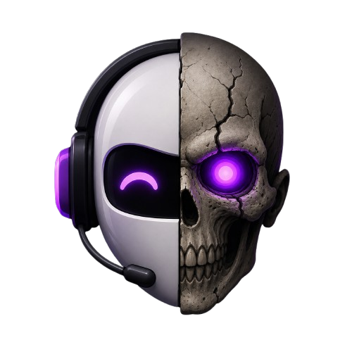

# The Meaning of the Ubuntu Zombie Logo

The Ubuntu Zombie logo is a single head split vertically down the
middle. The left half is a smooth white robot wearing black
over-ear headphones with a boom microphone. The right half is a
weathered, cracked human skull. Both halves share the same eye line,
the same jaw line, and the same glowing purple eye, so the two
pieces read as one face rather than two pasted together.

Every element on the logo maps to something the project actually
promises in [`README.md`](README.md), [`docs/VISION.md`](docs/VISION.md),
and [`SECURITY.md`](SECURITY.md). Nothing here is decoration.

## The split face: one machine, two identities

The vertical split is the project in one image. A machine that runs
Ubuntu Zombie is still an ordinary Ubuntu Desktop PC for the human
in front of it (the human, organic side), and it is simultaneously
the home of a root-capable AI Systems Administrator that lives
inside it (the machine, manufactured side). The two halves are
fused into one head because they are the same computer, the same
disk, the same network identity — not a separate appliance and not
a hosted service.

The seam is deliberately clean and centered. The AI does not
"take over" the machine and the human does not pretend the AI
isn't there. They share one face, one jaw, one eye line.

## The robot half (left): the AI Systems Administrator

- **Smooth white shell.** The administrator is a clean, well-defined
  software surface: a named Linux user (`zombie` by default,
  renameable via `ZOMBIE_USER`), a policy gate, an audit log, a chat
  UI on `127.0.0.1:7878`. It is engineered, inspectable, and replaceable.
- **Headphones and boom microphone.** The administrator only acts
  when it is spoken to. You open a private chat, you ask the
  machine to do something, it proposes, you approve, it acts.
  It is a listener with a mouth, not an autonomous agent that
  decides what the PC is for.
- **Curved, calm "eye."** The robot eye is drawn as a gentle upward
  arc — a content, attentive expression. The administrator is meant
  to feel like a helpful operator on call, not a threatening force.

## The skull half (right): the zombie, and what "zombie" means here

- **Human skull.** This is an Ubuntu *Zombie*, not an Ubuntu *Robot*.
  The machine was already a real PC with a real owner before the
  installer ran. The skull says: there is a person's computer
  underneath this; the AI is reanimating capability that already
  belonged to the owner, not summoning a new creature.
- **Cracks across the bone.** Real machines are imperfect — drivers
  drift, packages break, configs rot. The cracks acknowledge that
  the administrator's actual job is diagnosing, explaining,
  repairing, and operating a messy real system, including the
  `doctor` and `repair` subcommands.
- **Bared teeth.** The skull is not smiling and not snarling. It is
  exposed. Ubuntu Zombie is honest about the fact that it grants a
  root-capable identity on your machine; `SECURITY.md` exists for
  exactly this reason. The teeth are a reminder, not a threat.

## The shared purple eye: the operator's kill switch

Both halves share a single style of glowing purple eye. The robot
side shows it as a calm curve; the skull side shows it as a bright,
focused point of light in the socket. The shared color and shared
glow are the most important element in the logo:

- **One light, one will.** The same operator owns both halves. The
  SSH private key, the LLM API key, the Tailscale account, the
  policy file, and the kill switch all belong to the human in front
  of the machine. The AI does not have its own independent eye.
- **The light is on because the operator turned it on.** When the
  operator runs `sudo ./scripts/install.sh uninstall`, the light
  goes out on both sides at once. Nothing in the logo glows without
  consent.
- **Purple, not red.** Red would read as hostile; blue would read
  as a generic tech mascot. Purple sits between the white plastic
  of the robot and the bone of the skull and belongs to neither —
  it is the operator's color, layered on top of both identities.

## The headphones, again: the network boundary

The headphones are only on the robot side, and they are wired. This
mirrors the network posture described in `README.md` and
`SECURITY.md`: the administrator listens on a private channel
(local chat, or SSH tunneled over a private Tailscale tailnet),
not on the open internet. There is no public inbound exposure;
the "ears" are cupped and cabled, not antennas broadcasting in
every direction.

## What the logo is *not* saying

- It is not a horror mark. The skull is weathered, not bloody; the
  robot is calm, not menacing. The tone matches the project's
  promise to be a useful, auditable tool, not a stunt.
- It is not "AI replaces human." The human half is literally still
  there, sharing the same face. The AI is an administrator *for*
  the owner of the machine, not a replacement *of* them.
- It is not a brand for a hosted service. There is no cloud, no
  swoosh, no third-party logo. The face is self-contained, because
  the machine is self-contained: the operator owns the hardware,
  the keys, and the off switch.

## One-line reading

> An ordinary PC (the skull) with a calm, listening, root-capable
> AI Systems Administrator fused to it (the robot), sharing one
> glowing eye that belongs to the operator who can turn it off.
